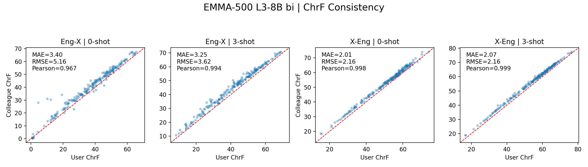
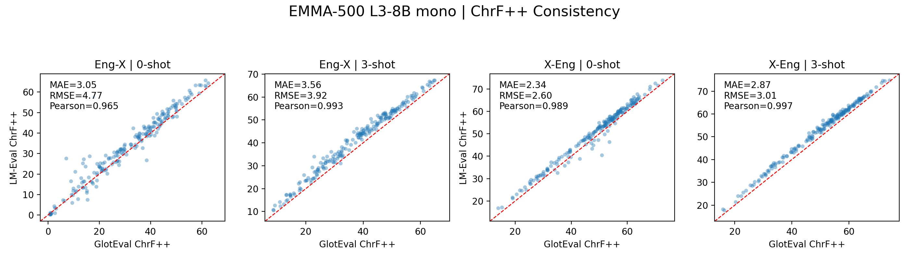
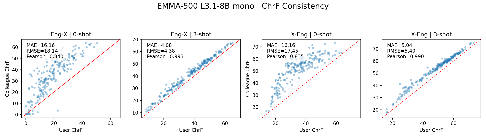
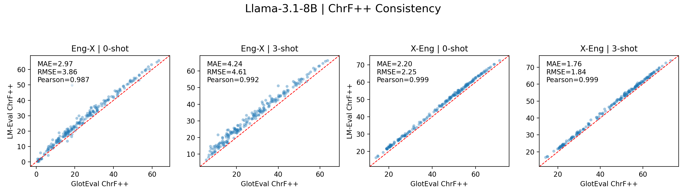
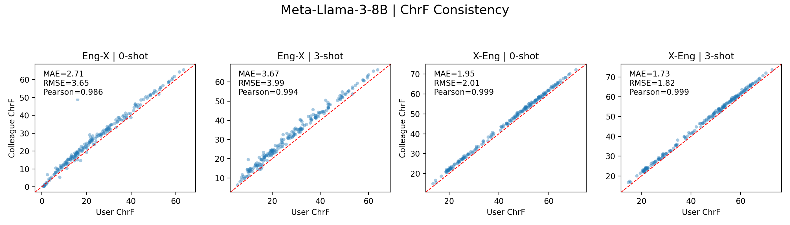

# 🌍GlotEval: Massively Multilingual Evaluation of Large Language Models 

GlotEval is a unified evaluation toolkit designed to benchmark Large Language Models (LLMs) across **multiple languages and tasks**. It supports text classification, machine translation, summarization, token classification, and open-ended generation, with a focus on **massively multilingual** coverage, evaluating models across over 1500 languages.

## 📚 Table of Contents

- [✨ Key Features](#key-features)
- [⚙️ Requirements](#requirements)
- [🚀 Quickstart](#quickstart)
- [🛠️ Configuration & Customization](#configuration--customization)
- [🧰 Utility Tools](#utility-tools)
- [📤 Expected Output](#expected-output)
- [🤝 Contributing](#contributing)
- [📄 License](#license)
- [📚 Citation](#citation)
- [📊 Consistency Study (ChrF)](#-consistency-study-chrf)

------

## ✨Key Features

### 🌐 Consistent Multilingual Benchmarking

- Standardized ISO 639-3 language code alignment
- Support for diverse language families (Bantu, Dravidian, Uralic, etc.)
- Automatic language mapping for large-scale benchmarks

### 🗣️ Language-Specific Prompt Templates

- Centralized multilingual prompt library
- Configure prompts per language
- Automatic prompt translation via Microsoft Translator (130+ languages)

### 🔁 Non-English-Centered Machine Translation

- Evaluate translation beyond English-centric pivots and English-centric prompts
- Support `any-to-pivot` and `pivot-to-any` directions for multi-aligned MT benchmarks

### 🧪 Multilingual Tasks

- **Text Classification**: SIB-200, Taxi-1500
- **Machine Translation**: Flores-200, Flores+, AmericasNLP, IN22, NTREX-128, Tatoeba, NTEU, TICO-19, MAFAND, MMHB (MT-based Bias Detection), OpenSubtitles
- **Summarization**: XLSum, MassiveSumm(2 versions)
- **Token Classification**: WikiANN, UD
- **Comprehension**: MMLU-style tasks (MMMLU, Global-MMLU)
- **Open-ended Generation**: Aya, PolyWrite
- **Intrinsic Evaluation**: PBC, MaLA
- **Instruction Following**: BenchMAX Rule-based
- **Reasoning**: BenchMAX Math, BenchMAX Science

### 🤖 Model Compatibility

- **HuggingFace Transformers**: for classification, tagging, etc.
- **vLLM**: efficient, large-batch generation for generation tasks

### 📏 Rich Evaluation Metrics

- **Machine Translation**: BLEU, ChrF++, COMET, etc.
- **Summarization**: ROUGE-L
- **Classification**: Accuracy, F1
- **Open-ended Generation**: Self-BLEU, etc.
- **Instruction Following**: Prompt-level and Instruction-level Accuracy (strict & loose)
- **Reasoning**: Accuracy


------

## ⚙️Requirements

- Python 3.11+
- PyTorch
- Additional libraries: `transformers`, `vllm`, `pandas`, `sacrebleu`, etc.
- Benchmark-specific data files: .conllu, .tsv, .jsonl, etc.

------

## 🚀Quickstart

### 1️⃣ Clone the Repository

```bash
git clone https://github.com/MaLA-LM/GlotEval
cd GlotEval
```

### 2️⃣ Set Up Environment

```bash
conda create -n gloteval python=3.11
conda activate gloteval
pip install -r requirements.txt
# BenchMax related dependencies
pip install -r requirements_benchmax_rule_based.txt
```

### 3️⃣ Prepare Data

- A number of datasets support **HuggingFace datasets** loading
- For others, please download benchmark data from Github Release under `benchmark_dataset/`, e.g.:
  - `benchmark_dataset/flores200`
  - `benchmark_dataset/ntrex128`
- Update paths in `config.json` if needed

### 4️⃣ Run an Evaluation

```bash
python main.py \
  --model_name "Qwen/Qwen2-1.5B" \
  --benchmarks xlsum sib200 \
  --params config.json \
  --output_dir results \
  --langs zho gsw por fra fin \
  --store_details \
  --efficiency_analysis
```

#### 📝 Notes:

- `--model_name`: Hugging Face model name or your local model path
- `--benchmarks`: Choose one or more tasks
- `--params`: Path to the config file specifying prompts, shots, etc.
- `--output_dir`: Directory to store results
- `--langs`: ISO 639-3 codes (e.g., `zho=Chinese`, `gsw=Swiss German`)
- `--store_details`: Save detailed output for each sample in JSONL format
- `--efficiency_analysis`: Track and report token generation efficiency metrics

### 5️⃣ Check Results

- Results saved under: `results/<model>/<timestamp>/`
- Includes: `scores.json`, detailed JSONLs (if enabled)


## 📊 Consistency Study (ChrF)

A brief write-up of our FLORES-200 GlotEval ↔ LM Evaluation Harness alignment and the corresponding ChrF scatter plots live in [`Consistency_Study.md`](Consistency_Study.md). Figures are also embedded below for quick reference.

| Eng → X & X → Eng (ChrF) | |
| --- | --- |
|  |  |
|  |  |
|  |  |

------

## 🛠️Configuration & Customization

The central configuration is in `config.json`, which specifies:

### 🔧 Model Arguments

```json
"model_args": {
  "device": "cuda",
  "tensor_parallel_size": 1,
  "batch_size": 1,
  "dtype": "auto",
  "max_num_seqs": 256,
  "sampling_params": {
    "temperature": 0.6,
    "top_p": 0.9,
    "max_tokens": 128
  }
}
```

### 🧑‍🏫 Prompt Strategy

```json
"prompt_language_strategy": "single",
"prompt_language": "eng_Latn",
```

- `"single"`: Use the same prompt in one language for all datasets
- `"multi"`: Use language-specific prompts when available

### 🧪 Benchmark-Specific Parameters

```json
"benchmark_params": {
  "flores200_mt": {
    "n_shots": 3,
    "seed": 42,
    "center_lang": "eng_Latn",
    "direction": "center-x",
    "sampling_params": {
      "stop": "\n"
    }
  },
  "xlsum": {
    "n_shots": 0,
    "seed": 42
  }
}
```

### 📋 Task-Specific Prompt Guidelines

```json
"prompt_guidelines": {
  "translation": {
    "required_placeholders": ["{src_text}", "{tgt_lang}"],
    "optional_placeholders": ["{src_lang}"],
    "description": "For translation tasks, the instruction template must include {src_text} and {tgt_lang}."
  }
}
```

------

## 🧰Utility Tools

GlotEval includes two important utility tools that enhance its multilingual capabilities:

### 🔠 1. Language ID Alignment

The language alignment tool standardizes language codes from various benchmarks to the ISO 639-3 format with script information (e.g., `eng_Latn`, `zho_Hans`). This enables seamless cross-benchmark language-specific evaluation.

[📘 Read more about Language ID Alignment](https://github.com/MaLA-LM/GlotEval/blob/main/benchmark_data_loader/data_langid_alignment/README.md)

Features:

- Processes inconsistent language codes from benchmarks (e.g., zh, zho, cmn, Chinese)
- Maps to standardized ISO 639-3 codes with script information
- Automatically detects scripts using GlotScript
- Handles special cases like CJK scripts with precise identification

### 🧾 2. Multilingual Prompt Builder

This tool helps create and manage prompts in multiple languages for all evaluation tasks.

[📘 Read more about the Multilingual Prompt Builder](https://github.com/MaLA-LM/GlotEval/blob/main/benchmark_data_loader/multilingual_prompt_builder/README.md)

Features:

- Translates prompts from a source language to 130+ target languages
- Preserves placeholders during translation
- Supports various prompt formats for different tasks
- Creates a comprehensive prompt library for consistent multilingual evaluation

------

## 📤Expected Output

After running an evaluation, GlotEval produces:

### 🧾 1. scores.json

```json
{
  "xlsum": {
    "zho_Hans": {
      "rouge_l_f1": 0.342
    },
    "fra_Latn": {
      "rouge_l_f1": 0.387
    }
  },
  "sib200": {
    "zho_Hans": {
      "accuracy": 0.78
    }
  }
}
```

### 📊 2. Detailed JSONLs (if `--store_details` is specified)

- Contains each sample's prompt, model output, reference, and corresponding scores
- Useful for fine-grained error analysis and qualitative evaluation

### ⏱️ 3. Efficiency Report (if `--efficiency_analysis` used)

- Metrics include tokens per second, prefill and decode times, etc.

### 📁 Output Directory Structure

```
results/
  └── Qwen--Qwen2-0.5B/
      ├── 20250704_173639/
      │   ├── massivesumm_short/
      │   │   ├── fra.jsonl
      │   │   ├── yue.jsonl
      │   │   ├── zho.jsonl
      │   │   └── ...
      │   ├── mmhb/
      │   │   ├── eng-cmn.jsonl
      │   │   ├── eng-fra.jsonl
      │   │   └── ...
      │   ├── mmmlu/
      │   │   ├── fr.jsonl
      │   │   ├── zh.jsonl
      │   │   └── ...
      │   └── scores.json
      └── 20250704_173640/
          ├── sib200/
          │   └── ...
          ├── taxi1500/
          │   └── ...
          ├── scores.json
          └── efficiency.json
```

------

## 🤝Contributing

We welcome contributions! Please see the [guidelines](https://github.com/MaLA-LM/GlotEval/blob/main/Guidelines.md) and how to get involved.

------

## 📄License

GlotEval is released under the [Apache-2.0 license](https://github.com/MaLA-LM/GlotEval?tab=Apache-2.0-1-ov-file#readme).

------

## 📚Citation

```
@article{gloteval,
    title={GlotEval: A Test Suite for Massively Multilingual Evaluation of Large Language Models}, 
    author={Hengyu Luo and Zihao Li and Joseph Attieh and Sawal Devkota and Ona de Gibert and Shaoxiong Ji and Peiqin Lin and Bhavani Sai Praneeth Varma Mantina and Ananda Sreenidhi and Raúl Vázquez and Mengjie Wang and Samea Yusofi and Jörg Tiedemann},
    year={2025},
    journal={arXiv preprint 2504.04155},
    url={https://arxiv.org/abs/2504.04155}, 
}
```
